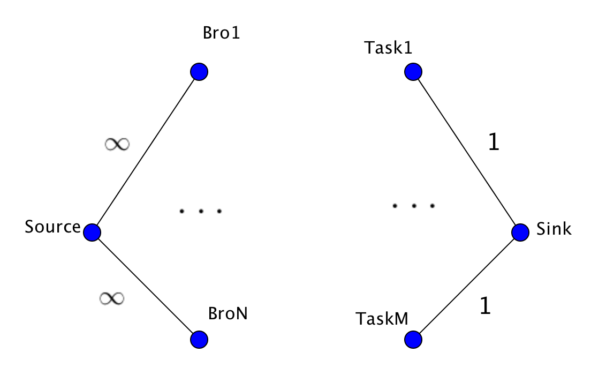

## Introduction

This is the updated midnight maker script for ZBT Fraternity at MIT.


## Installation

See the directions here: https://help.github.com/articles/cloning-a-repository/

## How to Use

CD into the directory you created from the step above. Go to a terminal and 
type 

```python
python3 midnightmaker.py
```

This will automatically pull the current data about preferences and points
and output this week's assignments (once we have the website running)

## Quick Overview of the Algorithm

There are three main parts to the midnight assigning algorithm.

### Specification

Every brother gets to specify two things:

1) The tasks they would like to do and not like to do
2) The days they would like to work and not like to work

### Bucketing

Brothers are bucketed into four quartiles based on their current midnight points.
Quartle 1 has the most points and quartile 4 has the least points.
Since quartile 1 bros have a lot of points, they should not be doing a lot of midnights
and similarly, quartile 4 bros should be doing most of the midnights. Currently, the number of tasks per week is 54. The breakdown of tasks allocated to each quartile is: Quartile 1: 7, Quartile 2: 10, Quartile 3: 16, Quartile 4: 21
(roughly 10%, 20%, 30%, 40%).

### Matching 

Given the specification and bucketing constraints above, we try to determine if 
if all the tasks throught the week can be done (a valid assignment). This is done by creating a graph that encodes the constraints above and reformulating the problem as a maximum flow problem. (Details about this in the section below.) If an assignemnt is possible, we are done. Otherwise, we take away the specification constraints of the quartile 4 brothers and try agian. If we are done, great; otherwise, we take away the specifications of the quartile 3 brothers and try again etc. If there are no specifications of all the brothers, we are guarenteed to find a vlaid assignment (see section below). Therefore, this algorithm must terminate.

## Detailed Overview of the Algorithm

### Graph construction

Suppose we have N bros that do midnights and M tasks this week. We represent each bro and task as a vertex. We also add a source and a target vertex. We connect each of the bro vertices to the source vertex with an edge of capacity infinity. We also connect each task vertex to the target vertex with an edge of capacity 1.

<center> 
</center>

### Encoding Specification Constraints

### Encoding Bucketing Constraints

### Max Flow 


